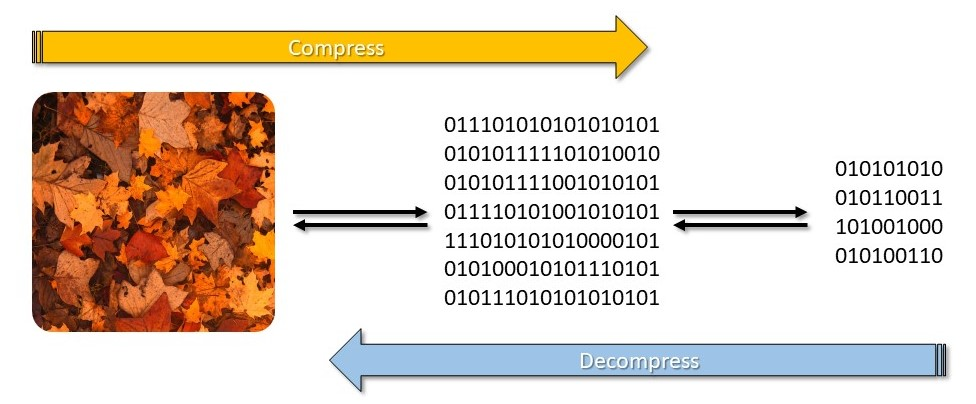

According to Wikipedia:
>In computer science and information theory, a Huffman code is a particular type of optimal prefix code that is commonly used for **lossless** data compression.
>The output from Huffman's algorithm can be viewed as a **variable-length** code table for encoding a source symbol (such as a character in a file). The algorithm derives this table from the **estimated probability** or **frequency of occurrence** (weight) for each possible value of the source symbol. As in other entropy encoding methods, more common symbols are generall represented using fewer bits than less common symbols.
[Huffman tree](https://upload.wikimedia.org/wikipedia/commons/thumb/8/82/Huffman_tree_2.svg/330px-Huffman_tree_2.svg.png)

